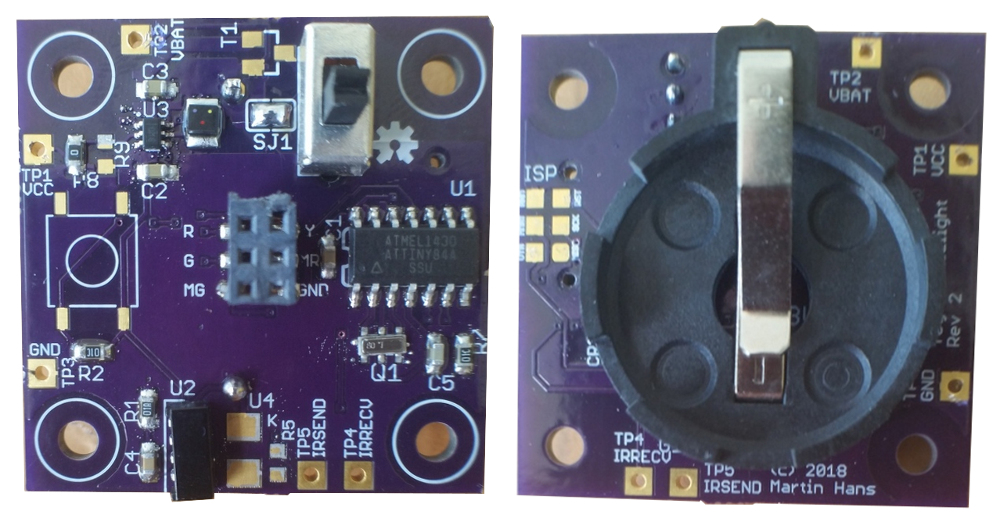
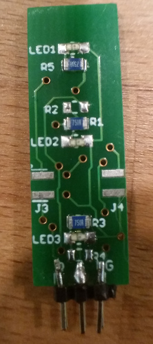
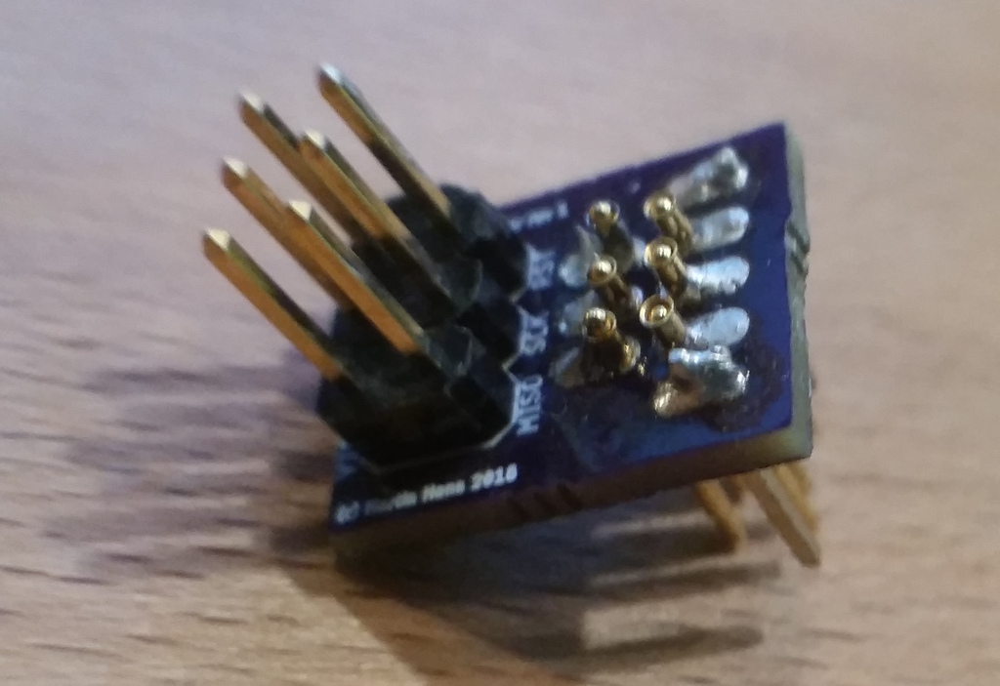
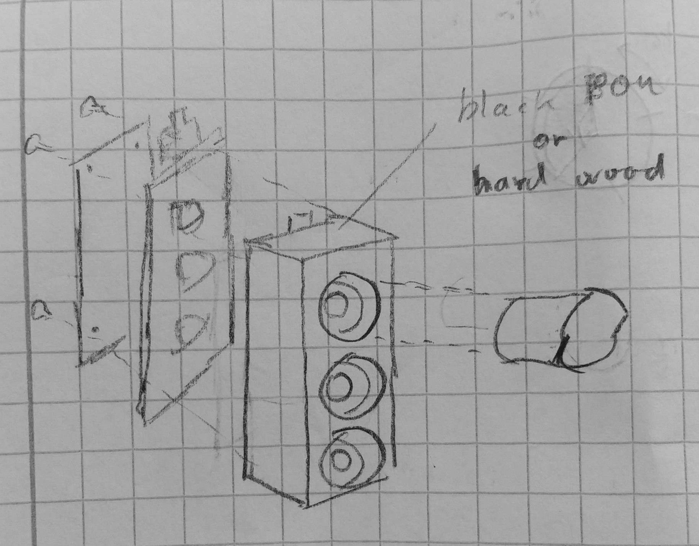
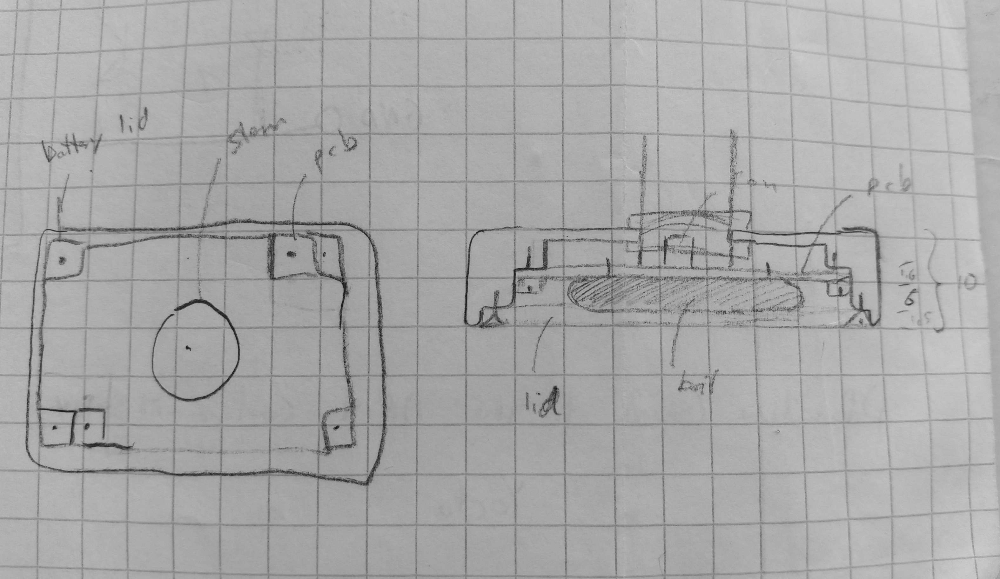

Toy traffic light
=================

Firmware for a toy traffic light with intrafred communication between the units.

Features
--------

* The master light sends the timing to the slaves so independent lights remain
  in sync
* Automatic mode follows a preprogrammed timing
* Manual mode allows controlling the light through a button press on the master

Electronics
-----------

  * [schematic](pcb/MCU%20board_in_foot_v2.pdf)
  * [BOM](pcb/MCU%20board_in_foot_BOM_v2.html)
  * [EAGLE schematic](pcb/MCU%20board_in_foot_v2.sch)
  * [EAGLE layout](pcb/MCU%20board_in_foot_v2.brd)

The MCU board in the foot of the traffic light contains 

  * a 3V CR2032 battery 
  * an on/off button
  * a boost converter circuit that brings the voltage up to 3.3V
  * an ATTINY84 MCU running at 4 MHz
  * a push button (master only)
  * an IR LED (master only)
  * an IR receive module (slave only)
  * a connector for connecting to the LED board
  * a few test points
  * pads for accessing the ISP port of the MCU using pogo pins

Errata for this version of the board:

  * IRSEND on wrong gpio pin, should be on PB2
  * The IR receiver module has the wrong footprint - it should be the version that looks up
  * The boost converter does not start from CR2032, but works from alkaline
  * Some silk screen is too small
  * Difficult to remove battery from battery holder
  * ISP pins are hard to use. An edge connector would be better.

  * [schematic](pcb/LEDs_in_top.pdf)
  * [BOM](pcb/LEDs_in_top_BOM.html)
  * [EAGLE schematic](pcb/LEDs_in_top.sch)
  * [EAGLE layout](pcb/LEDs_in_top.brd)

The LED board of the traffic light contains

  * red, yellow and green LEDs with resistors
  * a connector for connecting to the MCU board
  * edge connector for adding another board with pedestrian lights or similar

  * [schematic](pcb/pogo_pin_programmer_adapter.pdf)
  * [EAGLE schematic](pcb/pogo_pin_programmer_adapter.sch)
  * [EAGLE layout](pcb/pogo_pin_programmer_adapter.brd)

A special purpose pogo pin adapter board brings the footprint of the
ISP header down to a size that is small enough to fit the MCU
board. It also provides access to some debug pins.

This version does not work that well, so I'll probably find a better
solution for the next revision.

Firmware
========

The firmware is written in C.

 * Timer 0 triggers once every 1 ms and drives the light schedule
 * Timer 1 triggers once every 50us and is used by the IR receive code
 * hal/pins.h contains the macros for controlling the GPIO pins in an efficient yet readable manner

For IR communication it uses a library based on
https://github.com/shirriff/Arduino-IRremote. The source of the ATTINY C port
seems to have disappeared from the Internet, so I can't link to it.

The firmware is not feature complete yet. To do:

 * get the IR receive code working
 * implement manual mode
 * use button to select between different programs
 * autodetect master or slave mode
 * use sleep modes

Communication protocol
======================

The communication protocol is RC5 on a 36 kHz carrier frequency. An 18 bit word is sent every time:

 * `data[17]    =    1` : start bit
 * `data[16:10] = 0x5a` : command/address
 * `data[9]     = mode` : 1=manual mode, 0=automatic mode
 * `data[8:0]   = time` : unit is 0.5s

Firmware build instructions
===========================

To build the firmware on Ubuntu or Debian do the following:

    sudo apt-get install gcc-avr binutils-avr avr-libc avrdude
    git clone https://github.com/martinhansdk/traffic_light.git
    
Connect an AVR programmer such as an usbasp to the board. The
programmer has to be set to slow mode and 3.3V operation. Edit the
Makefile to change the programmer type if needed and run
    
    make clean
    make MASTER=1
    make fuse
    make flash
    
To program a slave run the above with `MASTER=0`.

To run the unittests

    make test
    
The unittests execute on the host machine.

Mechanics
=========

The mechanics have not been designed yet, but the traffic light will
be around 10 cm high. The following sketches are from the initial
brainstorming of the concept:

